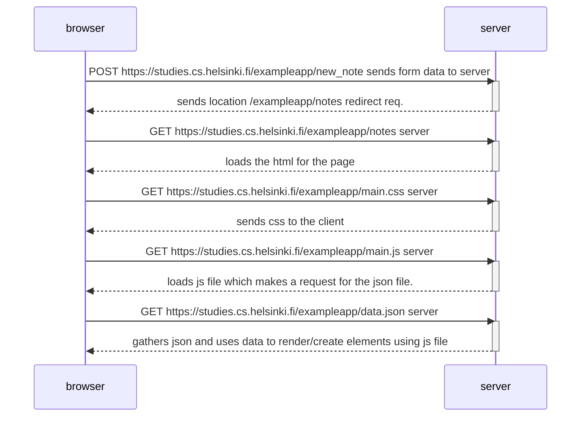

```mermaid
sequenceDiagram
    participant browser
    participant server


	browser->>server: POST https://studies.cs.helsinki.fi/exampleapp/new_note sends form data to server
    activate server
    server-->>browser: sends location /exampleapp/notes redirect req.
    deactivate server

	browser->>server: GET https://studies.cs.helsinki.fi/exampleapp/notes  server
    activate server
    server-->>browser: loads the html for the page
    deactivate server
	
	
	browser->>server: GET https://studies.cs.helsinki.fi/exampleapp/main.css  server
    activate server
    server-->>browser: sends css to the client
    deactivate server
	
	browser->>server: GET https://studies.cs.helsinki.fi/exampleapp/main.js  server
    activate server
    server-->>browser: loads js file which makes a request for the json file.
    deactivate server

browser->>server: GET https://studies.cs.helsinki.fi/exampleapp/data.json  server
    activate server
    server-->>browser: gathers json and uses data to render/create elements using js file
    deactivate server
```