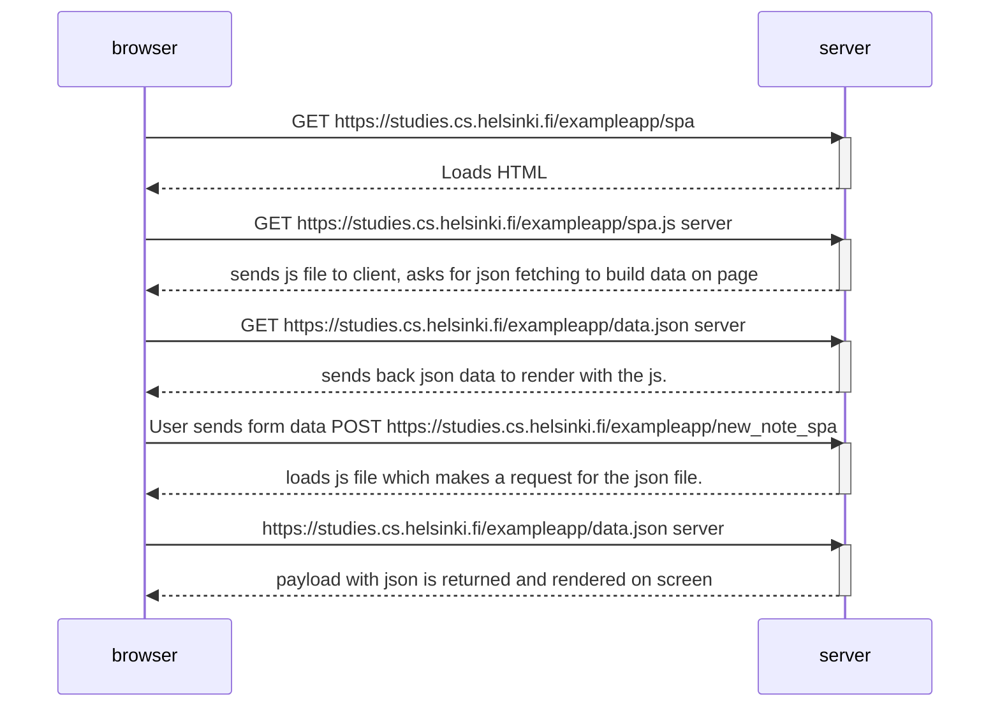

```mermaid
sequenceDiagram
    participant browser
    participant server


	browser->>server: GET https://studies.cs.helsinki.fi/exampleapp/spa 
    activate server
    server-->>browser: Loads HTML
    deactivate server

	browser->>server: GET https://studies.cs.helsinki.fi/exampleapp/spa.js  server
    activate server
    server-->>browser: sends js file to client, asks for json fetching to build data on page
    deactivate server
	
	
	browser->>server: GET https://studies.cs.helsinki.fi/exampleapp/data.json  server
    activate server
    server-->>browser: sends back json data to render with the js.
    deactivate server
	
	browser->>server: User sends form data POST https://studies.cs.helsinki.fi/exampleapp/new_note_spa
    activate server
    server-->>browser: loads js file which makes a request for the json file.
    deactivate server

browser->>server:  https://studies.cs.helsinki.fi/exampleapp/data.json  server
    activate server
    server-->>browser:payload with json is returned and rendered on screen
    deactivate server
```